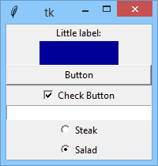

### Building a GUI application from scratch

Now we're going to build a very simple and rather useless GUI application. Does that sound weird? Maybe, but the application, when ready, will make you more accustomed to some tkinter habits and conventions.

Our fabulous goal will look like the vision presented below:

Are you ready? Let's start.