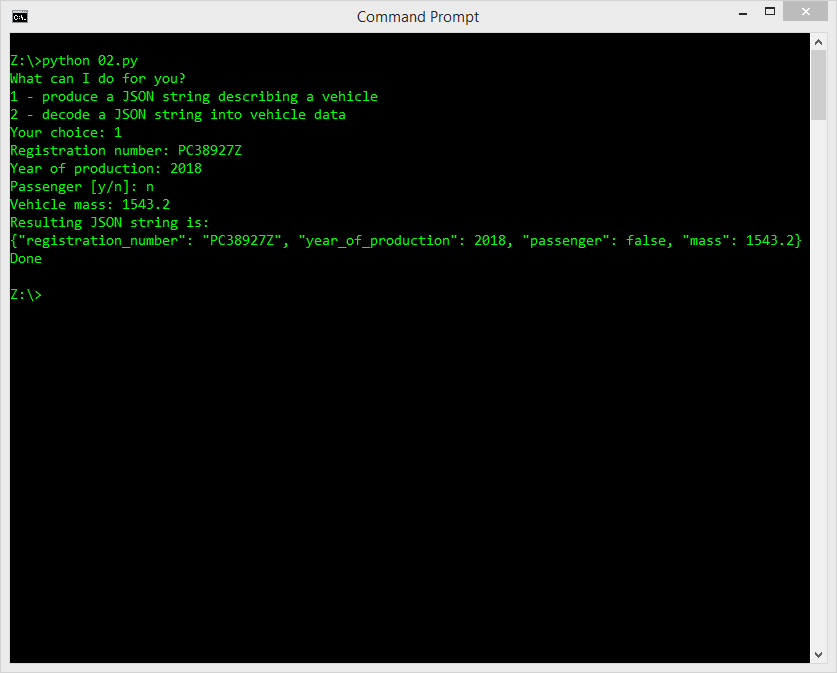
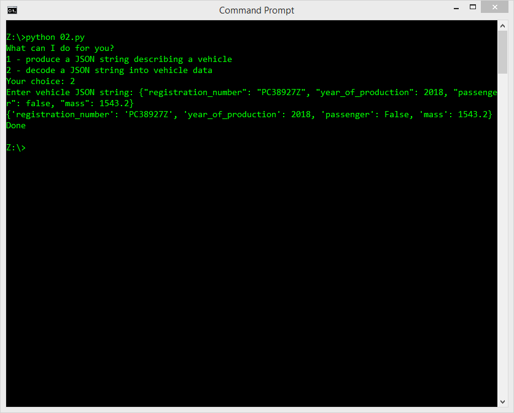

## Estimated time
30-45 minutes

## Level of difficulty
Medium

## Objectives

Learn how to:
- Use the json module and its basic facilities;
- Encode and decode JSON strings from/to Python objects.

## Scenario
Take a look at these two screenshots. They present two different use cases of the same program:

Your task is to write a code which has exactly the same conversation with the user and:

1. Defines a class named Vehicle, whose objects can carry the vehicle data shown above (the structure of the class should be deducted from the above dialog — call it "reverse engineering" if you want)
2. Defines a class able to encode the Vehicle object into an equivalent JSON string;
3. Defines a class able to decode the JSON string into the newly created Vehicle object.

Of course, some basic data validity checks should be done, too. We're sure you're careful enough to protect your code from reckless users.