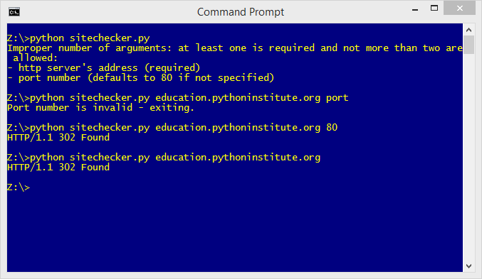

## Estimated time

20-30 minutes

## Level of difficulty

Easy

## Objectives

Learn how to:
- Use the socket module and its basic functionalities
- Manage simple http connections

## Scenario

We want you to write a simple CLI (Command Line Interface) tool which can be used in order to diagnose the current status of a particular http server. The tool should accept one or two command line arguments:

1. (Obligatory) the address (IP or qualified domain name) of the server to be diagnosed (the diagnosis will be extremely simple, we just want to know if the server is dead or alive)
2. (Optional) the server's port number (any absence of the argument means that the tool should use port 80)
3. Use the HEAD method instead of GET — it forces the server to send the full response header but without any content; it's enough to check if the server is working properly; the rest of the request remains the same as for GET.

We also assume that:
- The tool checks if it is invoked properly, and when the invocation lacks any arguments, the tool prints an error message and returns an exit code equal to 1;
- If there are two arguments in the invocation line and the second one is not an integer number in the range 1..65535, the tool prints an error message and returns an exit code equal to 2;
- If the tool experiences a timeout during connection, an error message is printed and 3 is returned as the exit code;
- If the connection fails due to any other reason, an error message appears and 4 is returned as the exit code;
- If the connection succeeds, the very first line of the server’s response is printed. 

Hints:
- To access command line arguments, use the argv variable from the sys module; its length is always one more than the actual number of arguments, as argv[0] stores your script's name; this means that the first argument is at argv[1] and the second at argv[2]; don't forget that the command line arguments are always strings!
- Returning an exit code equal to n can be achieved by invoking the exit(n) function.

Assuming that the tool is placed in a source file name sitechecker.py, here are some real-use cases:

