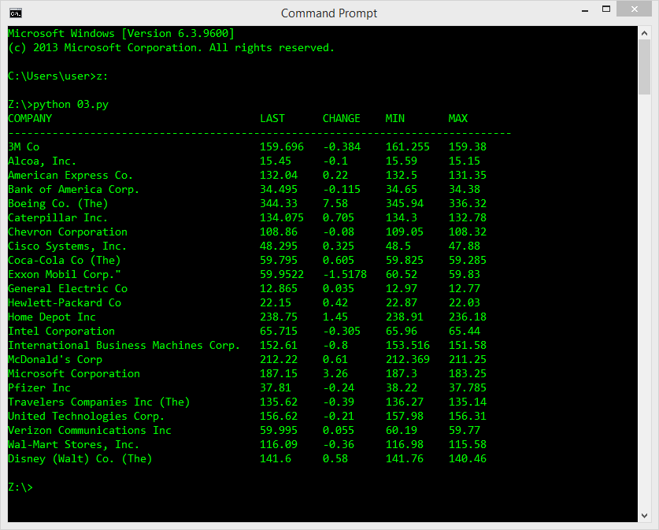

## Estimated time
15-25 minutes

## Level of difficulty
Easy

## Objectives
Learn how to:
- Read and parse simple XML files using the xml.etree.ElementTree module;
- Deal with XML nodes and properties.

## Scenario
Download and open the following XML file in your favorite text editor:
[nyse.xml](../persistance/nyse.xml)

It's a small excerpt of the New York Stock Exchange quotes list. Take a look at it and analyze its structure. You need to do this as your task is to write a code which reads the data and presents it in a form similar to this one:

Hints:

1. Don't forget to handle at least two possible exceptions: FileNotFoundError and xml.etree.ElementTree.ParseError;
2. Feel free to improve and beautify the output — we know perfectly well that ours is not very sophisticated and rather ugly. object. 